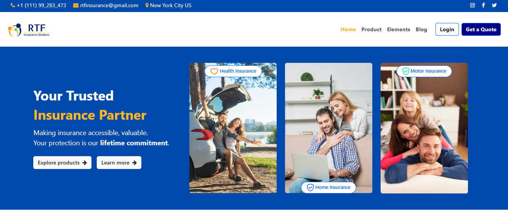
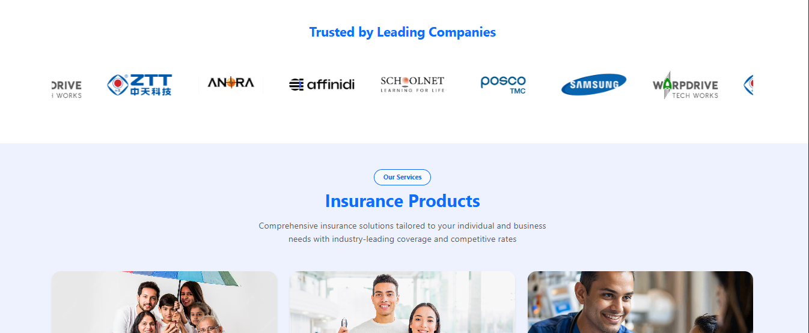
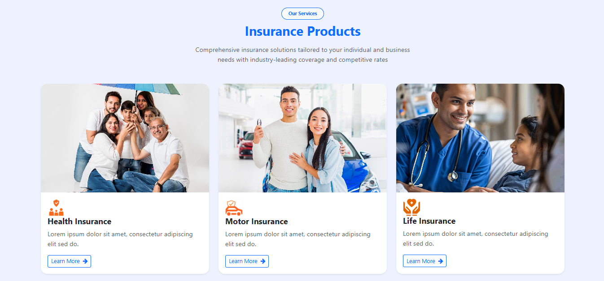
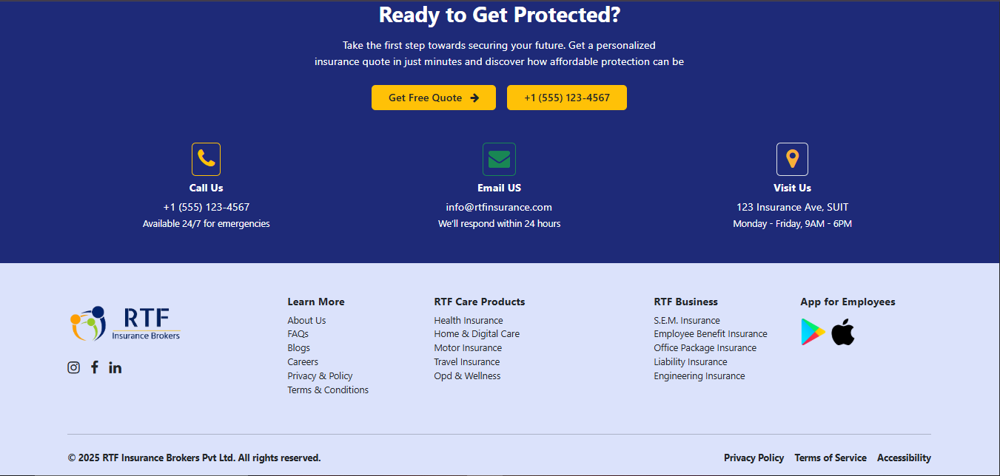

# 🛡️ RTF Insurance Brokers - Landing Page

A responsive, visually rich website for RTF Insurance Brokers built using **HTML5**, **CSS3**, **Bootstrap 5**, and **Font Awesome**. Designed to showcase services, build trust, and convert leads effectively.

---

## 🔍 Project Structure

- `index.html` – Main landing page
- `assets/images/` – Screenshots and placeholder images
- `styles.css` - Additional CSS
- Responsive across mobile, tablet, and desktop

---

## 📸 Screenshots & Sections

### 1. **Landing Section**

Includes contact info, social icons, and primary navigation.
Two-column layout: left has heading & CTA, right shows 3 insurance types.

---

### 2. **Trusted by Leading Companies**

Auto-scrolling logos of partner companies.

---

### 3. **Insurance Products**

Cards displaying key insurance categories with icons, text, and Learn More buttons.

---

### 4. **Glimpses of Our Dashboard**

Vertical icon list on the left, dashboard screenshot on the right.

---

### 7. **Get Protected Section & Footer**

Call-to-action with contact buttons and icons for phone, email, and location.
Includes logo, social media, company/product links, and app download buttons.

---

## 🛠️ Technologies Used

- HTML5
- CSS3
- Bootstrap 5
- Font Awesome
- Responsive Grid Layout
